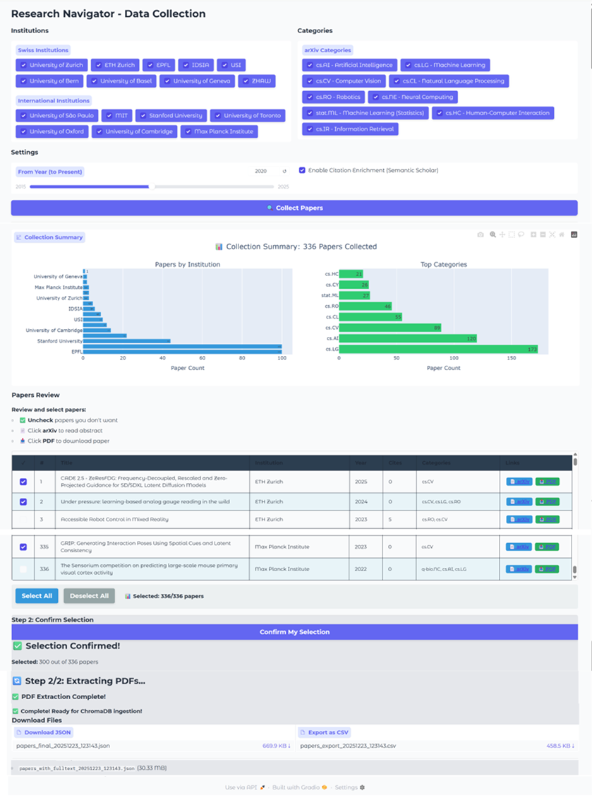
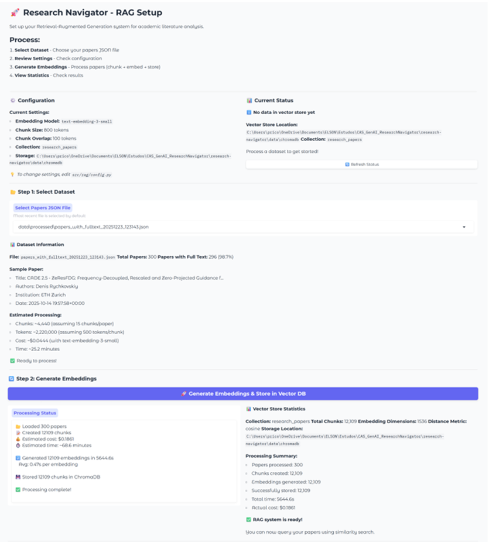
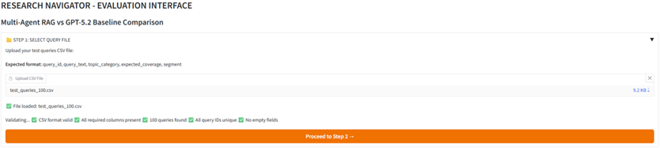
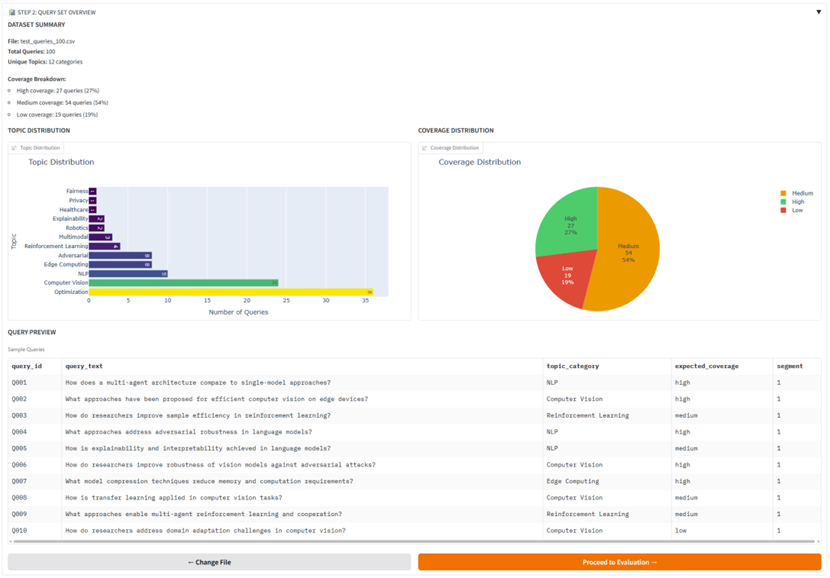
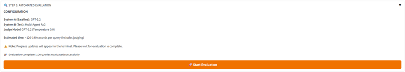
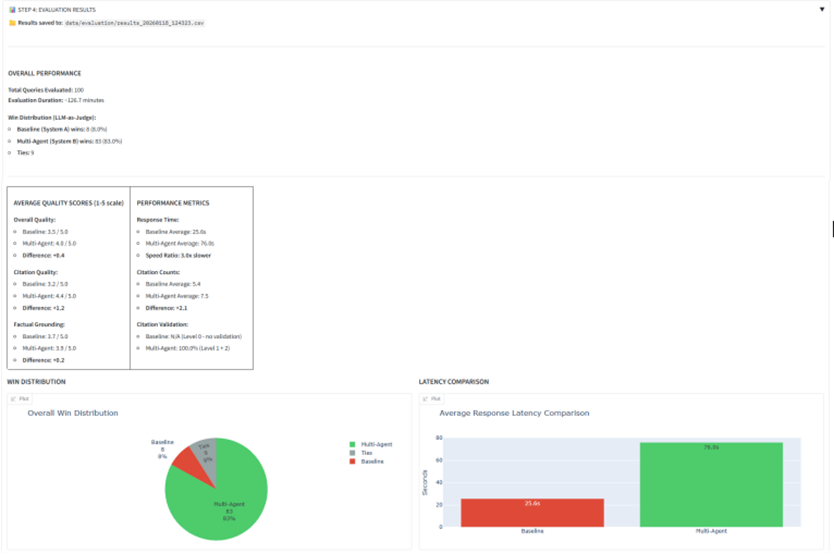
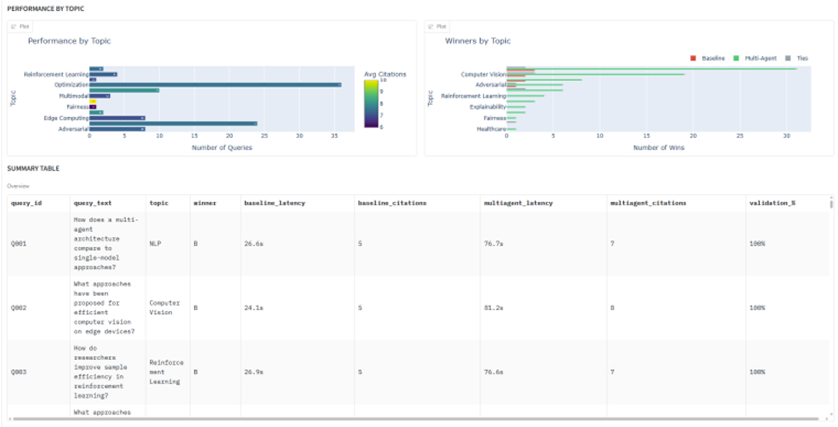

# Evaluation Experiment - Detailed Documentation

This document provides comprehensive details about the evaluation experiment that compared the multi-agent RAG system against a single LLM baseline.

---

## Overview

The evaluation was designed to assess whether a multi-agent RAG architecture with specialized retrieval, synthesis, and validation agents delivers measurable quality improvements over a single LLM baseline for academic literature synthesis tasks.

**Research Question:** *"How does a multi-agent RAG architecture compare to a single LLM approach for academic literature synthesis in terms of response quality?"*

This work was conducted as part of my thesis for the Certificate of Advanced Studies (CAS) in Generative AI at the University of Zurich. The complete thesis document is available here: [CAS_Gen_AI_SeminarPaper_ELSON_FILHO.pdf](CAS_Gen_AI_SeminarPaper_ELSON_FILHO.pdf)

---

## Table of Contents

1. [System Components](#1-system-components)
2. [Experiment Execution](#2-experiment-execution)
3. [Conclusions](#3-conclusions)
4. [References](#4-references)
5. [Data Files and Locations](#5-data-files-and-locations)

---

## 1. System Components

### Corpus Collection and Processing

A custom Gradio interface (`paper_collector_ui.py`) automates paper collection from arXiv across AI research categories (cs.AI, cs.CV, cs.CL, cs.LG, etc.), filtering by institution and publication year (2020-2025). The workflow guides users through five steps: configuring filters (Swiss and international institutions), retrieving papers via arXiv API with summary statistics, reviewing and refining selections through an interactive table, confirming the final set, and executing full PDF text extraction using PyPDF2 and pdfminer.six. The system enriches metadata with citation counts from Semantic Scholar and outputs structured JSON files containing 17 fields per paper—critically including full extracted text rather than abstracts alone—stored in `data/processed/` for downstream RAG pipeline ingestion.

*Figure A1: Paper collection and management interface (paper_collector_ui.py)*

### RAG Setup - Text Processing and Vector Storage

Following corpus collection, a Gradio interface (`rag_setup_ui.py`) automates the text processing pipeline through four stages: chunking, embedding generation, vector storage, and validation. The system segments full-text papers into 800-token chunks with 100-token overlap using semantic boundaries (paragraphs, sentences, then spaces), processes them through OpenAI's `text-embedding-3-small` model with batch processing and retry logic, and persists embeddings in ChromaDB with cosine similarity indexing. The complete pipeline transforms raw PDFs into a queryable vector database (stored in `data/chromadb/`), displaying real-time progress and final statistics to confirm successful storage of all 12,109 chunks with preserved metadata.

*Figure B1: Text processing and vector storage configuration interface (rag_setup_ui.py)*

**Vector Database Configuration:**
- Database: ChromaDB
- Location: `data/chromadb/`
- Collection: `research_navigator_corpus`
- Index type: HNSW (Hierarchical Navigable Small World)
- Distance metric: Cosine similarity

**Metadata Schema (13 fields per chunk):**
- `chunk_id`, `chunk_text`, `title`, `authors`, `year`, `institution`, `arxiv_id`, `abstract`, `venue`, `topics`, `citation_count`, `full_text`, `source`

### Baseline System

The baseline system (`baseline_agent.py`) represents the typical single-LLM approach researchers use: GPT-5.2 queried directly without retrieval, external tools, or citation validation. Operating solely on parametric knowledge (training cutoff: August 2025), the system uses temperature 0.5 to balance consistency and diversity, processing queries through a single synchronous API call. The system prompt instructs 600-word responses citing 4-6 key papers with formal academic formatting. With average response times of ~5 seconds, this streamlined architecture establishes the performance baseline for measuring the multi-agent system's quality improvements and latency trade-offs.

**Configuration:**
- Model: GPT-5.2 (OpenAI API)
- Temperature: 0.5
- Max tokens: 2,000
- System prompt: Academic synthesis with citation requirements
- Response target: ~600 words
- Citations requested: 4-6 key papers
- Average latency: ~5 seconds

### Multi-Agent RAG Infrastructure

The multi-agent system comprises six specialized agents orchestrated through the LangGraph framework, prioritizing response quality and citation reliability over speed. All agents inherit from a common base class (`base_agent.py`) providing standardized logging, configuration, and communication through `AgentResponse` objects containing content, metadata, and status. The Coordinator Agent (`coordinator_agent.py`) manages a four-phase workflow: Phase 0 conditionally invokes Query Decomposition for complex queries; Phase 1 executes parallel retrieval through both Retrieval and Parametric agents via asyncio (reducing latency ~50%); Phase 2 validates citations through external databases; Phase 3 synthesizes validated results into coherent academic prose.

| Agent | Primary Role | Key Capabilities |
|-------|-------------|------------------|
| Coordinator | Workflow orchestration | Phase management, routing, parallel execution |
| Query Decomposition | Complex query handling | Temporal analysis, multi-aspect breakdown, sub-query generation |
| Retrieval | Corpus search | Semantic search, hybrid retrieval (dense + sparse), reranking, full-text access |
| Parametric | LLM knowledge access | GPT-5.2 synthesis, reference extraction, contextual integration |
| Citation Validator | Reference verification | Triple-fallback (ArXiv → OpenAlex → Google Scholar), two-tier validation |
| Synthesis | Multi-source integration | Combines corpus + parametric sources, source-tagged citations, natural prose |

*Table 1: Multi-Agent System Components*

Each agent serves a specialized function: Query Decomposition detects complexity through heuristic checks (temporal keywords, comparison phrases) and generates 2-5 sub-queries when needed; Retrieval Agent wraps ChromaDB with hybrid search (top-k=5, threshold=0.35) combining dense vectors and BM25 sparse matching; Parametric Agent (similar as Baseline) accesses GPT-5.2's training knowledge (temperature 0.5) extracting 4-6 key paper references; Citation Validator implements two-tier validation (Level 1 for corpus metadata, Level 2 with triple-fallback for LLM citations including ±2 year tolerance); Synthesis Agent (temperature 0.1) combines both sources into ~600-word academic prose with 8-10 validated citations. This architectural complexity—featuring parallel execution, specialized processing, and multi-stage validation—trades increased latency for measurable quality improvements.

### Evaluation Interface

The evaluation infrastructure (`evaluation_ui.py`) implements a seven-step Gradio web interface guiding users through systematic comparative evaluation from query upload through statistical validation. The workflow ensures reproducibility through automated processing, incremental result saving, and comprehensive data export capabilities.

**7-Step Evaluation Workflow:**

- **Step 1: Upload Test Queries** - Accepts CSV files with required columns (`query_id`, `query_text`, `topic_category`, `expected_coverage`, `segment`), validates file format, checks for unique identifiers, and detects empty fields before proceeding.

- **Step 2: Verify Metadata** - Displays query distribution across topics and corpus coverage levels through interactive Plotly visualizations, confirming balanced test sets before evaluation begins.

- **Step 3: Run Automated Evaluation** - Sequentially processes each query through both systems (multi-agent RAG and baseline), invokes the LLM judge for quality assessment, and saves 22 data fields incrementally (query metadata, system responses, citation counts with source breakdown, judge scores across three dimensions, winner determination, and reasoning). Real-time progress tracking prevents data loss during extended runs.

  **LLM-as-Judge:**
  
  The evaluation employed GPT-5.2 as an impartial judge to assess response quality across three dimensions using 1-5 Likert scales. The Judge class (`judge.py`) configured the model with temperature 0.0 for consistent evaluation and implemented detailed scoring rubrics for each dimension. 
  
  - **Overall Quality** assessed comprehensiveness (coverage of main approaches and recent developments), structure (organization and coherence), depth (beyond surface-level description), and synthesis (comparison rather than enumeration).
  
  - **Citation Quality** evaluated relevance of citations to specific claims, recency (preferring more recent papers for fast-moving AI topics), balance between foundational and recent work, specificity (author names and years versus vague references), and appropriate citation quantity.
  
  - **Factual Grounding** measured specificity of claims with concrete details, attribution to known or validated sources, technical accuracy, and verifiable statements.
  
  The prompts explicitly instructed the judge to use the full 1-5 scale rather than clustering around middle values. The judge returned structured JSON output containing six-dimension scores, winner determination, and detailed reasoning citing specific examples from both responses.

- **Step 4: View Individual Results** - Presents results through interactive components including summary statistics (total queries, win distribution, average quality scores), four dynamic visualizations (win distribution, response latencies, performance by topic, winner counts per topic), and detailed query-by-query views with side-by-side response comparisons, complete judge evaluations, and winner reasoning.

- **Step 5: Statistical Significance Tests** - Executes Wilcoxon Signed-Rank Tests for the three quality dimensions and Binomial Test for win rate analysis, displaying formatted results with test statistics, p-values, effect sizes (Cohen's d), significance indicators, and interpretive text (α=0.05 threshold).

- **Step 6: Export Evaluation Results** - Provides CSV export functionality for complete evaluation data with all 22 collected fields per query.

- **Step 7: Download Statistical Summaries** - Offers downloadable statistical test reports for documentation and reproducibility.

---

## 2. Experiment Execution

This section documents the complete experimental workflow, from data collection through RAG setup to the comparative evaluation execution.

**Data Collection**

The corpus collection process began with 336 papers retrieved from arXiv, targeting specific AI research categories and institutions. Following manual review and automated processing, the final dataset comprised 296 papers with successfully extracted full text and enriched metadata.

**Collection Results:**
- Initial papers collected: 336
- Papers excluded during review: 36
- Papers failed extraction/enrichment: 4
- Final corpus: 296 papers (88.1% success rate)
- Output file: `data/processed/papers_with_fulltext_20251223_123143.json`

**Institutional Distribution:**
- Swiss institutions: ~178 papers (60%)
- International institutions: ~118 papers (40%)

**Research Areas:**
- Computer Vision: ~28%
- NLP: ~24%
- Edge Computing/Federated Learning: ~16%
- Reinforcement Learning: ~12%
- Others (Optimization, AI Safety, etc.): ~20%

**RAG Setup**

Following corpus collection, the 296 papers were processed through the RAG pipeline: text chunking, embedding generation, and vector storage in ChromaDB. The pipeline successfully processed all papers, creating a queryable vector database for the evaluation.

**Processing Results:**
- Total chunks created: 12,109
- Embedding model: text-embedding-3-small (OpenAI)
- Embedding dimension: 1,536
- Success rate: 100% (12,109/12,109 chunks)

**Evaluation**

The evaluation was conducted using a predefined test set consisting of 100 queries, stored in a structured CSV file (`test_queries_100.csv`), see Figure C.1. Analysis of the query set identified 12 distinct topical categories. Queries were segmented into four complexity levels, with 25 queries per segment. Query set statistics and distribution charts are shown in Figure C.2.

*Figure C.1: Test query selection and validation*

*Figure C.2: Query set summary and preview*

Following the query validation, the evaluation was executed using both the baseline system and the proposed multi-agent RAG system, as shown in Figure C.3. The evaluation completed successfully without system interruptions or failures. The total execution time for processing the full query set was 2 hours, 6 minutes, and 42 seconds.

*Figure C.3: Automated evaluation execution progress*

The win distribution across all 100 queries is presented in Table 2. The multi-agent RAG system achieved wins in 83% of cases, the baseline in 8%, and 9% resulted in ties. Additionally, both systems were scored on the three quality dimensions: Overall Quality, Citation Quality, and Factual Grounding, using a 5-point Likert scale. Mean scores are presented in Table 3. These results are summarized visually in Figures C.4 and C.5.

*Figure C.4: Evaluation results - Win distribution and quality metrics*

*Figure C.5: Evaluation results - Performance by topic and coverage*

**Table 2: Overall Win Distribution**

| System | Wins | Percentage |
|--------|------|------------|
| Multi-Agent RAG | 83 | 83% |
| Baseline | 8 | 8% |
| Ties | 9 | 9% |

**Table 3: Quality Metrics Comparison (Mean Scores, 1-5 Scale)**

| Metric | Baseline | Multi-Agent RAG | Difference (Δ) |
|--------|----------|-----------------|----------------|
| Overall Quality | 3.53 | 3.96 | +0.43 |
| Citation Quality | 3.20 | 4.37 | +1.17 |
| Factual Grounding | 3.66 | 3.91 | +0.25 |

Statistical significance tests were conducted on the 91 non-tie queries (α = 0.05). Results are presented in Table 4.

**Table 4: Statistical Significance Tests**

| Test | Metric | Test Statistic | p-value | Cohen's d |
|------|--------|----------------|---------|-----------|
| Wilcoxon Signed-Rank Test | Overall Quality | W = 135.0 | < 0.001 | 0.73 (medium) |
| Wilcoxon Signed-Rank Test | Citation Quality | W = 137.5 | < 0.001 | 1.43 (large) |
| Wilcoxon Signed-Rank Test | Factual Grounding | W = 416.0 | 0.0016 | 0.33 (small) |
| Binomial Test | Win Rate (83/91 = 91.2%) | - | < 0.001 | - |

Response generation times were recorded for both systems across all queries. Results are reported in Table 5.

**Table 5: Response Latency Statistics**

| System | Mean Latency (seconds) | Standard Deviation | Latency Ratio |
|--------|------------------------|-------------------|---------------|
| Multi-Agent RAG | 76.0 | 18.3 | 3.0x |
| Baseline | 25.6 | 4.2 | 1.0x |

Win rates were analyzed across the three corpus coverage levels. Results are presented in Table 6.

**Table 6: Performance by Corpus Coverage Level**

| Coverage | Queries (n) | Baseline Wins | Multi-Agent Wins | Ties | Multi-Agent Win Rate |
|----------|-------------|---------------|------------------|------|---------------------|
| High | 27 | 4 | 21 | 2 | 77.8% |
| Medium | 54 | 4 | 46 | 4 | 85.2% |
| Low | 19 | 0 | 16 | 3 | 84.2% |

Win rates were calculated for each of the 12 topic categories. Results are presented in Table 7.

**Table 7: Win Distribution by Topic Category**

| Topic | Queries (n) | Baseline Wins | Multi-Agent Wins | Ties | Multi-Agent Win Rate |
|-------|-------------|---------------|------------------|------|---------------------|
| Optimization | 36 | 3 | 31 | 2 | 86.1% |
| Computer Vision | 24 | 2 | 19 | 3 | 79.2% |
| NLP | 10 | 2 | 8 | 0 | 80.0% |
| Adversarial | 8 | 1 | 6 | 1 | 75.0% |
| Edge Computing | 8 | 0 | 6 | 2 | 75.0% |
| Reinforcement Learning | 4 | 0 | 4 | 0 | 100% |
| Multimodal | 3 | 0 | 3 | 0 | 100% |
| Robotics | 2 | 0 | 2 | 0 | 100% |
| Explainability | 2 | 0 | 2 | 0 | 100% |
| Healthcare | 1 | 0 | 1 | 0 | 100% |
| Fairness | 1 | 0 | 1 | 0 | 100% |
| Privacy | 1 | 0 | 0 | 1 | 0% |

The complete evaluation run, including all 100 query results, detailed judge evaluations, and system responses, is documented in [Screen_Evaluation_UI_100.pdf](Screen_Evaluation_UI_100.pdf).

---

## 3. Conclusions

### Primary Results

**Multi-Agent Dominance:**
- **83% win rate** vs 8% baseline (10.4x advantage)
- **All quality metrics** show statistically significant improvement
- **Success across all topics, coverage levels, and complexities**

**Citation Quality as Key Differentiator:**
- **Largest improvement: +1.17 points (+36.6%)**
- **Effect size: Cohen's d = 1.43 (Large)**
- Validates architectural focus on citation verification

**Acceptable Latency Trade-off:**
- **3x slower** than baseline (76s vs 25.6s)
- **Quality improvement justifies increased processing time**
- For high-stakes academic synthesis, speed sacrifice is worthwhile

### Architectural Validation

**Multi-Source Synthesis Works:**
- Effective integration of:
  - Corpus papers (depth, grounded)
  - LLM parametric (breadth, context)
  - External validation (credibility)

**Robust Across Coverage Levels:**
- **Counterintuitive finding:** Medium/Low coverage outperform High
- System adapts citation sources based on corpus availability
- Validates that corpus size is not sole determinant of quality

**Topic Generalization:**
- Win rates: 75-100% across 11 of 12 topics
- No topic shows baseline advantage
- Confirms architectural principles transfer across AI research domains

### Key Lessons

1. **Citation validation is critical**
   - Triple-fallback (ArXiv → OpenAlex → Scholar) achieves near-perfect coverage

2. **Multi-source integration > single source**
   - Combining corpus + LLM + validation outperforms any single approach
   - Adaptive synthesis based on available sources

3. **Specialized agents justify complexity**
   - Coordinator, Retrieval, Parametric, Validation, Synthesis each add value
   - Parallel execution mitigates latency overhead

4. **Quality metrics matter more than speed**
   - For academic synthesis, 3x latency acceptable for superior quality
   - Different use cases (quick lookup vs comprehensive review) need different systems

---

## 4. References

Ammar, W., Groeneveld, D., Bhagavatula, C., Beltagy, I., Crawford, M., Downey, D., ... & Etzioni, O. (2018). Construction of the literature graph in Semantic Scholar. *Proceedings of NAACL-HLT 2018*, 84-91. https://aclanthology.org/N18-3011/

Anthropic. (2024). Claude: Large language models for AI assistance. https://www.anthropic.com/claude

Bornmann, L., & Mutz, R. (2015). Growth rates of modern science: A bibliometric analysis based on the number of publications and cited references. *Journal of the Association for Information Science and Technology*, 66(11), 2215-2222. https://doi.org/10.1002/asi.23329

Chang, Y., Wang, X., Wang, J., Wu, Y., Yang, L., Zhu, K., ... & Xie, X. (2024). A survey on evaluation of large language models. *ACM Transactions on Intelligent Systems and Technology*, 15(3), 1-45. https://dl.acm.org/doi/10.1145/3641289

Chen, S., Wang, T., Liu, W., Chen, T., Li, M., Wang, X., ... & Liu, Q. (2024). A survey on LLM-based multi-agent systems: Recent advances and new frontiers in application. *arXiv preprint arXiv:2412.17481*. https://arxiv.org/abs/2412.17481

Gao, Y., Xiong, Y., Gao, X., Jia, K., Pan, J., Bi, Y., ... & Wang, H. (2024). Retrieval-augmented generation for large language models: A survey. *arXiv preprint arXiv:2312.10997*. https://arxiv.org/abs/2312.10997

Ji, Z., Lee, N., Frieske, R., Yu, T., Su, D., Xu, Y., ... & Fung, P. (2023). Survey of hallucination in natural language generation. *ACM Computing Surveys*, 55(12), 1-38. https://dl.acm.org/doi/10.1145/3571730

L'ala, D., Feldman, S., Candra, R., & Caragea, C. (2023). PaperQA: Retrieval-augmented generative agent for scientific research. *arXiv preprint arXiv:2312.07559*. https://arxiv.org/abs/2312.07559

Lewis, P., Perez, E., Piktus, A., Petroni, F., Karpukhin, V., Goyal, N., ... & Kiela, D. (2020). Retrieval-augmented generation for knowledge-intensive NLP tasks. *Advances in Neural Information Processing Systems*, 33, 9459-9474. https://proceedings.neurips.cc/paper/2020/hash/6b493230205f780e1bc26945df7481e5-Abstract.html

Liu, Y., Wu, Y., Zhang, D., & Sun, L. (2025). Agentic AutoSurvey: Let LLMs survey LLMs. *arXiv preprint arXiv:2509.18661*. https://arxiv.org/abs/2509.18661

OpenAI. (2025). *GPT-5.2 technical overview*. https://openai.com/

Park, J. S., O'Brien, J. C., Cai, C. J., Morris, M. R., Liang, P., & Bernstein, M. S. (2023). Generative agents: Interactive simulacra of human behavior. *Proceedings of UIST 2023*, 1-22. https://doi.org/10.1145/3586183.3606763

Wu, Q., Bansal, G., Zhang, J., Wu, Y., Li, B., Zhu, E., Jiang, L., Zhang, X., Zhang, S., Liu, J., Awadallah, A. H., White, R. W., Burger, D., & Wang, C. (2023). AutoGen: Enabling Next-Gen LLM Applications via Multi-Agent Conversation Framework. *arXiv*. https://arxiv.org/abs/2308.08155

Yamauchi, Y., Yano, T., & Oyamada, M. (2025). An empirical study of LLM-as-a-judge: How design choices impact evaluation reliability. *arXiv*. https://doi.org/10.48550/arXiv.2506.13639

Zhao, P., Zhang, H., Yu, Q., Wang, Z., Geng, Y., Fu, F., ... & Huang, X. (2024). Retrieval-augmented generation for AI-generated content: A survey. *arXiv preprint arXiv:2402.19473*. https://arxiv.org/abs/2402.19473

Zheng, L., Chiang, W. L., Sheng, Y., Zhuang, S., Wu, Z., Zhuang, Y., Lin, Z., Li, Z., Li, D., Xing, E. P., Zhang, H., Gonzalez, J. E., & Stoica, I. (2023). Judging LLM-as-a-judge with MT-bench and Chatbot Arena. *Advances in Neural Information Processing Systems*, 36, 46595-46623. https://proceedings.neurips.cc/paper_files/paper/2023/hash/91f18a85473732fe43f478ce2242e66d-Abstract-Datasets_and_Benchmarks.html

---

## 5. Data Files and Locations

**Source Data:**
- Corpus: `data/processed/papers_with_fulltext_20251223_123143.json`
- Vector DB: `data/chromadb/`
- Test queries: `data/test_queries/`
- Evaluation results: `data/evaluation/results_[timestamp].csv`

**User Interfaces:**
- `paper_collector_ui.py` - Paper selection, corpus collection and processing
- `rag_setup_ui.py` - Dataset selection and automation of: chunking, embedding generation, vector storage, and validation
- `evaluation_ui.py` - Guide through the systematic evaluation

---

**Document Version:** 1.0  
**Last Updated:** January 31, 2026  
**Status:** Complete

[↑ Back to Top](#evaluation-experiment---detailed-documentation)
